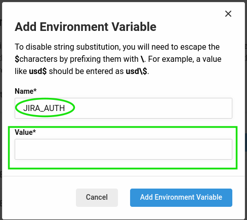

# Jira Releases

[](https://circleci.com/gh/mobomo/jira-releases) [](https://circleci.com/orbs/registry/orb/mobomo/jira-releases) [](https://raw.githubusercontent.com/mobomo/jira-releases/master/LICENSE) [](https://discuss.circleci.com/c/ecosystem/orbs)

This Orb helps you creating and releasing your Jira project versions.

**NOTE:** To avoid setting the auth token in your config files, you must define it as an CircleCI Environment Variable.

Using the CircleCI UI, you can go to your Project > Project Settings > Environment Values > Add Environment Value called
`JIRA_AUTH`

In order to encode the username:password string, you can run:
```shell
echo -n 'jira_user_email:jira_api_token' | openssl base64
```

Copy the base64 encoded string and paste it in the Environment Variable `Value` field:



## Usage example

```
version: 2.1
orbs:
  jira-releases: mobomo/jira-releases@1.0.0

[...]

  set-released:
    docker:
      - image: makocchi/alpine-git-curl-jq:latest
    steps:
      - jira-releases/release:
          release-name: $CIRCLE_TAG
          jira-url: "https://jira.project.url"
          jira-project: "KEY"
          release-prev: true
```
